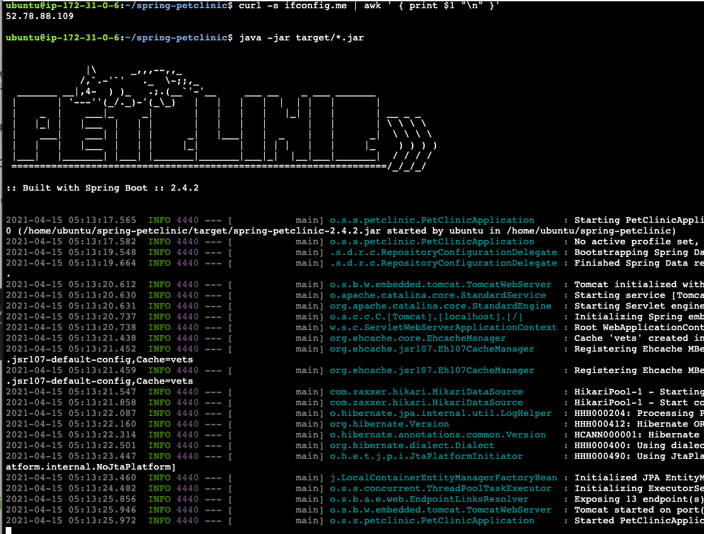
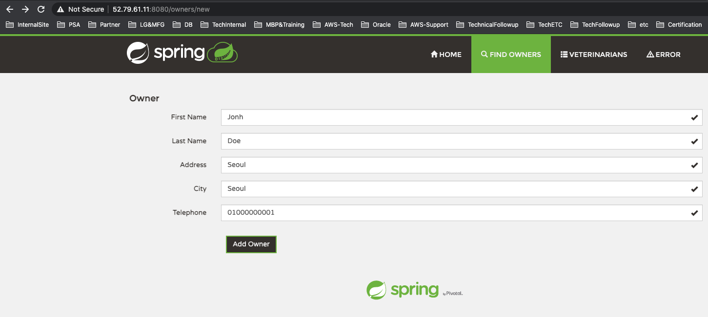
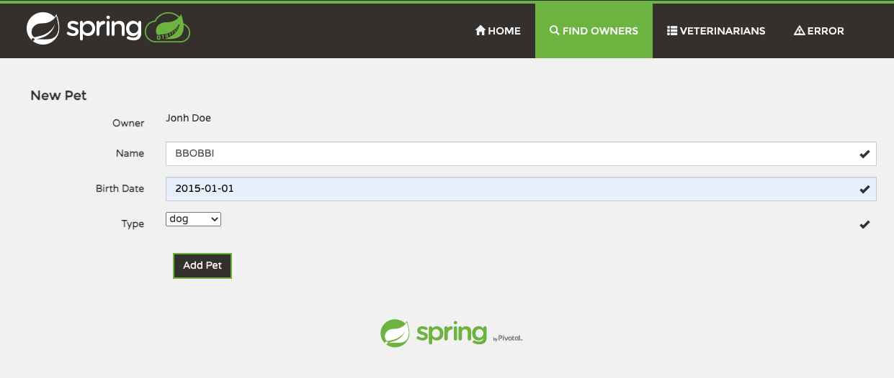
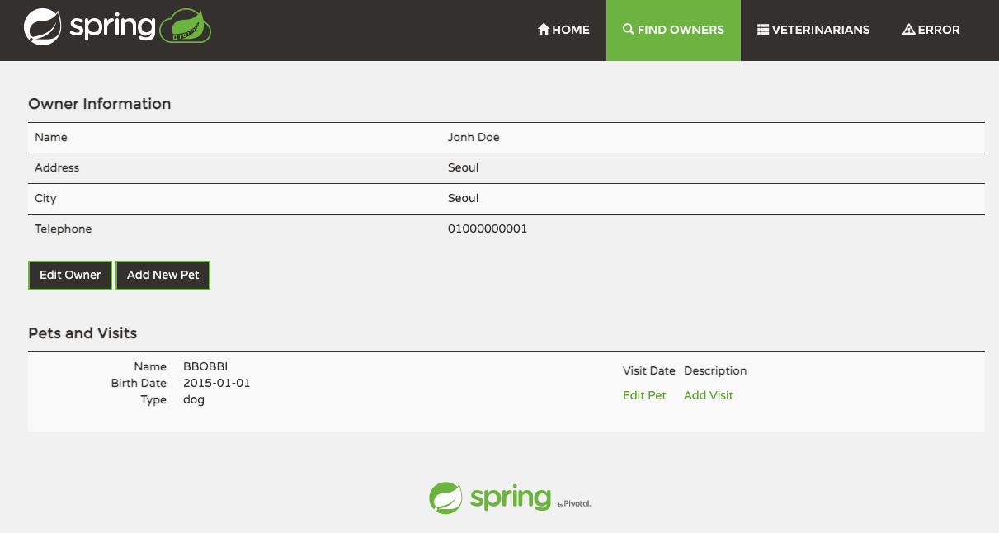
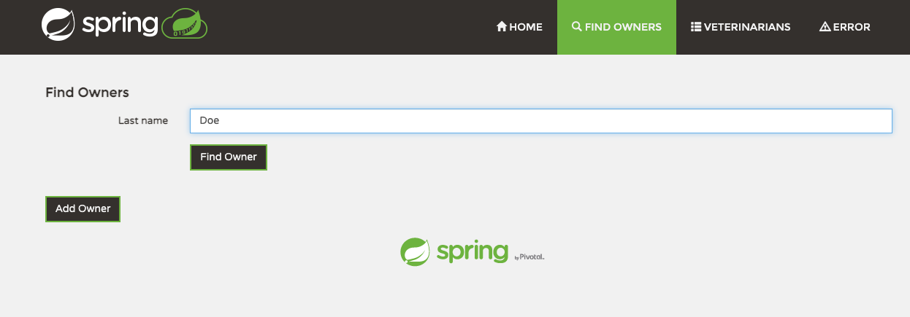
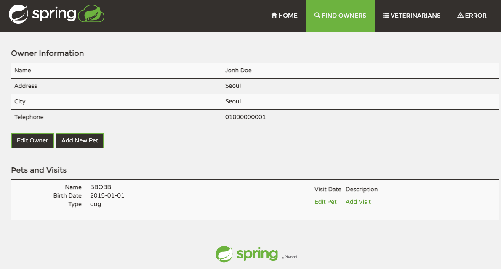

# SpringBoot PetClinic을 설치 / 접속 / Data 입력

### Session Manager를 이용해서 EC2 인스턴스에 접속

1. 다음의 주소를 복사해서 Browser의 새 창에 Copy and Paste합니다.

`https://ap-northeast-2.console.aws.amazon.com/systems-manager/session-manager?region=ap-northeast-2`

2. "Start Session"을 Click

<kbd>  </kbd>

3. `auroralab-mysql-workstation`을 선택한 후 "Start Session"을 Click

<kbd>  </kbd>

4. Terminal 이 뜨면 `sudo su -l ubuntu`를 통해 ssm-user에서 ubuntu User로 Switching.(항상 ubuntu User로 작업을 해야 합니다.)

<kbd>  </kbd>

5. `tail -n1 /debug.log`를 확인하여 다음의 Log를 확인하여 Instance가 정상 기동되었는지 확인

`* bootstrap complete, rebooting`

6. `env |grep DB` command를 이용하여 DB master user name과 password를 확인 합니다.

```
ubuntu@ip-172-31-0-183:~$ env |grep DB
DBUSER=masteruser
DBPASS=tbU642-*Y.
DBUS_SESSION_BUS_ADDRESS=unix:path=/run/user/1000/bus
```

6. mysql client를 사용해서 aurora instance로 접속을 확인합니다. [clusterEndpoint]는 Lab01에서 복사해둔 CloudFormation Output에서 확인 할 수 있습니다. select query를 통해 정상적으로 접속되는지 확인합니다. (clusterEndpoint를 따로 메모장에 복사합니다)

```
ubuntu@ip-172-31-0-145:~$ export DBURL=auroralab-mysql-cluster.cluster-cn9obtetnzbc.ap-northeast-2.rds.amazonaws.com
ubuntu@ip-172-31-0-145:~$ mysql -h$DBURL -u$DBUSER -p"$DBPASS" -e"SELECT @@aurora_version;"
mysql: [Warning] Using a password on the command line interface can be insecure.
+------------------+
| @@aurora_version |
+------------------+
| 2.09.1           |
+------------------+

```

**COMMAND & Output Example**

<kbd>  </kbd>

7. Install JDK 11 - spring

```
ubuntu@ip-172-31-0-217:~$ sudo apt-get install openjdk-11-jdk -y
```

8. PetClinic을 사용하기 위해서 git repository를 clone 하고 build 합니다.

```
ubuntu@ip-172-31-0-217:~$ git clone https://github.com/kiwonyoon0701/spring-petclinic.git
ubuntu@ip-172-31-0-217:~$ wget https://shared-kiwony.s3.ap-northeast-2.amazonaws.com/m2.tar.Z
ubuntu@ip-172-31-0-217:~$ tar xvfz m2.tar.Z
ubuntu@ip-172-31-0-217:~$ cd spring-petclinic/
ubuntu@ip-172-31-0-217:~/spring-petclinic$ ./mvnw package -Dmaven.test.skip=true
```

8. PetClinic Application을 기동합니다.

```
java -jar target/*.jar
```

<kbd>  </kbd>

9.  EC2의 Public IP 를 확인하고, PetClinic application을 실행 후 접속 테스트를 진행합니다.(EC2 IP를 메모장에 복사해둡니다.)

```
ubuntu@ip-172-31-0-145:~/spring-petclinic$ curl -s ifconfig.me | awk ' { print $1 "\n" }'
52.79.61.11
ubuntu@ip-172-31-0-145:~/spring-petclinic$ java -jar target/*.jar

```

1.  Browser에서 http://EC2-PublicIP:8080(ex: http://52.79.61.11:8080) 으로 접속합니다.
    <kbd>  </kbd>

2.  "Find OWNERS"를 Click 후 "Add Owner"를 Click하여 신규 고객 정보를 입력합니다. (Data는 내장 H2 DB에 저장됩니다.)
    <kbd>  </kbd>

3.  신규 고객의 신규 Pet 정보를 입력 합니다. "Add New Pet"을 Click 합니다.
    <kbd>  </kbd>

    <kbd>  </kbd>

4.  "FIND OWNERS"를 Click 후 방금 입력한 신규 사용자 정보를 검색합니다.
    <kbd>  </kbd>

    <kbd>  </kbd>

5.  이제 다음 챕터에서 PetClinic에서 사용하는 DB를 내장 H2 DB에서 Aurora MySQL DB로 변경하도록 하겠습니다.

6.  현재 실행중인 PetClinic Application을 중지합니다. (CTRL+C)로 실행중인 Java process를 종료합니다.

**앞으로 있을 Terminal 작업은 모두 위의 Session Manager 접속을 통해서 이뤄집니다.**
**Session Manager가 Timeout되서 Close될 경우 위의 순서로 다시 여시면 됩니다.**

14. 수고하셨습니다. 다음 챕터로 이동하세요. [AuroraLab03.md](AuroraLab03.md)
