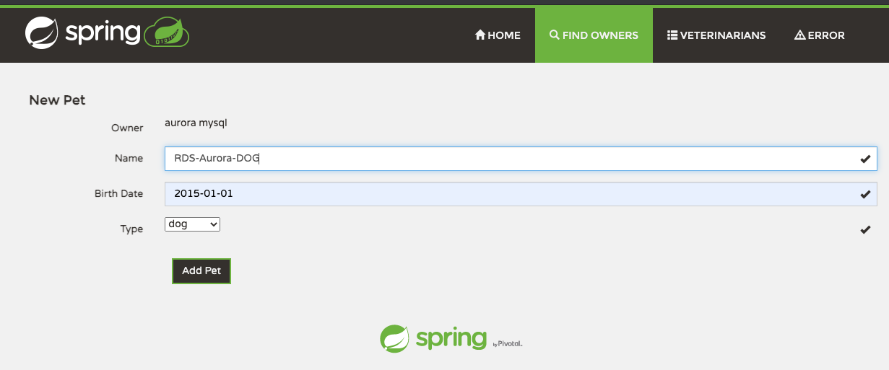
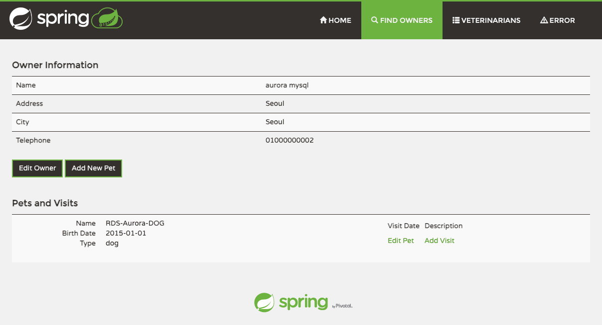
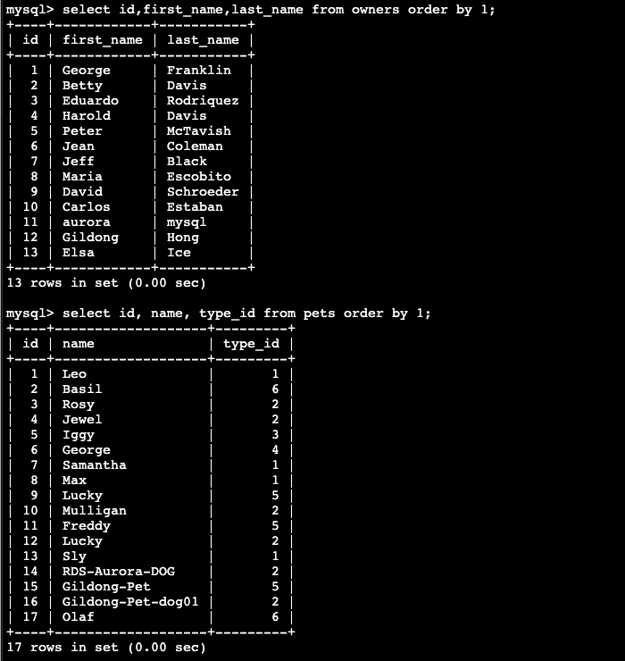

# PetClinic에서 사용하는 Repository를 Aurora MySQL로 변경

1. 다음 directory로 이동합니다.

```
ubuntu@ip-172-31-0-145:~/spring-petclinic$ cd src/main/resources/db/mysql/
ubuntu@ip-172-31-0-145:~/spring-petclinic/src/main/resources/db/mysql$ ls
data.sql  petclinic_db_setup_mysql.txt  schema.sql  user.sql

```

2. cat으로 user.sql, schema.sql, data.sql을 살펴 봅니다.

```
ubuntu@ip-172-31-0-6:~/spring-petclinic/src/main/resources/db/mysql$ cat user.sql
CREATE DATABASE IF NOT EXISTS petclinic;

ALTER DATABASE petclinic
  DEFAULT CHARACTER SET utf8
  DEFAULT COLLATE utf8_general_ci;

GRANT ALL PRIVILEGES ON petclinic.* TO 'petclinic'@'%' IDENTIFIED BY 'petclinic';
```

```
ubuntu@ip-172-31-0-6:~/spring-petclinic/src/main/resources/db/mysql$ cat schema.sql
CREATE TABLE IF NOT EXISTS vets (
  id INT(4) UNSIGNED NOT NULL AUTO_INCREMENT PRIMARY KEY,
  first_name VARCHAR(30),
  last_name VARCHAR(30),
  INDEX(last_name)
) engine=InnoDB;

CREATE TABLE IF NOT EXISTS specialties (
  id INT(4) UNSIGNED NOT NULL AUTO_INCREMENT PRIMARY KEY,
  name VARCHAR(80),
  INDEX(name)
) engine=InnoDB;

CREATE TABLE IF NOT EXISTS vet_specialties (
  vet_id INT(4) UNSIGNED NOT NULL,
  specialty_id INT(4) UNSIGNED NOT NULL,
  FOREIGN KEY (vet_id) REFERENCES vets(id),
  FOREIGN KEY (specialty_id) REFERENCES specialties(id),
  UNIQUE (vet_id,specialty_id)
) engine=InnoDB;

CREATE TABLE IF NOT EXISTS types (
  id INT(4) UNSIGNED NOT NULL AUTO_INCREMENT PRIMARY KEY,
  name VARCHAR(80),
  INDEX(name)
) engine=InnoDB;

CREATE TABLE IF NOT EXISTS owners (
  id INT(4) UNSIGNED NOT NULL AUTO_INCREMENT PRIMARY KEY,
  first_name VARCHAR(30),
  last_name VARCHAR(30),
  address VARCHAR(255),
  city VARCHAR(80),
  telephone VARCHAR(20),
  INDEX(last_name)
) engine=InnoDB;

CREATE TABLE IF NOT EXISTS pets (
  id INT(4) UNSIGNED NOT NULL AUTO_INCREMENT PRIMARY KEY,
  name VARCHAR(30),
  birth_date DATE,
  type_id INT(4) UNSIGNED NOT NULL,
  owner_id INT(4) UNSIGNED NOT NULL,
  INDEX(name),
  FOREIGN KEY (owner_id) REFERENCES owners(id),
  FOREIGN KEY (type_id) REFERENCES types(id)
) engine=InnoDB;

CREATE TABLE IF NOT EXISTS visits (
  id INT(4) UNSIGNED NOT NULL AUTO_INCREMENT PRIMARY KEY,
  pet_id INT(4) UNSIGNED NOT NULL,
  visit_date DATE,
  description VARCHAR(255),
  FOREIGN KEY (pet_id) REFERENCES pets(id)
) engine=InnoDB;
```

```
ubuntu@ip-172-31-0-6:~/spring-petclinic/src/main/resources/db/mysql$ cat data.sql
INSERT IGNORE INTO vets VALUES (1, 'James', 'Carter');
INSERT IGNORE INTO vets VALUES (2, 'Helen', 'Leary');
INSERT IGNORE INTO vets VALUES (3, 'Linda', 'Douglas');
INSERT IGNORE INTO vets VALUES (4, 'Rafael', 'Ortega');
INSERT IGNORE INTO vets VALUES (5, 'Henry', 'Stevens');
INSERT IGNORE INTO vets VALUES (6, 'Sharon', 'Jenkins');

INSERT IGNORE INTO specialties VALUES (1, 'radiology');
INSERT IGNORE INTO specialties VALUES (2, 'surgery');
INSERT IGNORE INTO specialties VALUES (3, 'dentistry');

INSERT IGNORE INTO vet_specialties VALUES (2, 1);
INSERT IGNORE INTO vet_specialties VALUES (3, 2);
INSERT IGNORE INTO vet_specialties VALUES (3, 3);
INSERT IGNORE INTO vet_specialties VALUES (4, 2);
INSERT IGNORE INTO vet_specialties VALUES (5, 1);

INSERT IGNORE INTO types VALUES (1, 'cat');
INSERT IGNORE INTO types VALUES (2, 'dog');
INSERT IGNORE INTO types VALUES (3, 'lizard');
INSERT IGNORE INTO types VALUES (4, 'snake');
INSERT IGNORE INTO types VALUES (5, 'bird');
INSERT IGNORE INTO types VALUES (6, 'hamster');

INSERT IGNORE INTO owners VALUES (1, 'George', 'Franklin', '110 W. Liberty St.', 'Madison', '6085551023');
INSERT IGNORE INTO owners VALUES (2, 'Betty', 'Davis', '638 Cardinal Ave.', 'Sun Prairie', '6085551749');
INSERT IGNORE INTO owners VALUES (3, 'Eduardo', 'Rodriquez', '2693 Commerce St.', 'McFarland', '6085558763');
INSERT IGNORE INTO owners VALUES (4, 'Harold', 'Davis', '563 Friendly St.', 'Windsor', '6085553198');
INSERT IGNORE INTO owners VALUES (5, 'Peter', 'McTavish', '2387 S. Fair Way', 'Madison', '6085552765');
INSERT IGNORE INTO owners VALUES (6, 'Jean', 'Coleman', '105 N. Lake St.', 'Monona', '6085552654');
INSERT IGNORE INTO owners VALUES (7, 'Jeff', 'Black', '1450 Oak Blvd.', 'Monona', '6085555387');
INSERT IGNORE INTO owners VALUES (8, 'Maria', 'Escobito', '345 Maple St.', 'Madison', '6085557683');
INSERT IGNORE INTO owners VALUES (9, 'David', 'Schroeder', '2749 Blackhawk Trail', 'Madison', '6085559435');
INSERT IGNORE INTO owners VALUES (10, 'Carlos', 'Estaban', '2335 Independence La.', 'Waunakee', '6085555487');

INSERT IGNORE INTO pets VALUES (1, 'Leo', '2000-09-07', 1, 1);
INSERT IGNORE INTO pets VALUES (2, 'Basil', '2002-08-06', 6, 2);
INSERT IGNORE INTO pets VALUES (3, 'Rosy', '2001-04-17', 2, 3);
INSERT IGNORE INTO pets VALUES (4, 'Jewel', '2000-03-07', 2, 3);
INSERT IGNORE INTO pets VALUES (5, 'Iggy', '2000-11-30', 3, 4);
INSERT IGNORE INTO pets VALUES (6, 'George', '2000-01-20', 4, 5);
INSERT IGNORE INTO pets VALUES (7, 'Samantha', '1995-09-04', 1, 6);
INSERT IGNORE INTO pets VALUES (8, 'Max', '1995-09-04', 1, 6);
INSERT IGNORE INTO pets VALUES (9, 'Lucky', '1999-08-06', 5, 7);
INSERT IGNORE INTO pets VALUES (10, 'Mulligan', '1997-02-24', 2, 8);
INSERT IGNORE INTO pets VALUES (11, 'Freddy', '2000-03-09', 5, 9);
INSERT IGNORE INTO pets VALUES (12, 'Lucky', '2000-06-24', 2, 10);
INSERT IGNORE INTO pets VALUES (13, 'Sly', '2002-06-08', 1, 10);

INSERT IGNORE INTO visits VALUES (1, 7, '2010-03-04', 'rabies shot');
INSERT IGNORE INTO visits VALUES (2, 8, '2011-03-04', 'rabies shot');
INSERT IGNORE INTO visits VALUES (3, 8, '2009-06-04', 'neutered');
INSERT IGNORE INTO visits VALUES (4, 7, '2008-09-04', 'spayed');
```

3. PetClinic DB와 User를 생성하는 script를 실행합니다.

```
mysql -h$DBURL -u$DBUSER -p"$DBPASS" < user.sql
```

```
ubuntu@ip-172-31-0-145:~/spring-petclinic/src/main/resources/db/mysql$ mysql -h$DBURL -u$DBUSER -p"$DBPASS" < user.sql
mysql: [Warning] Using a password on the command line interface can be insecure.
```

4. 신규 생성된 petclinic user를 이용하여 petclinic DB가 정상적으로 생성되었는지 확인합니다.

```
mysql -h$DBURL -upetclinic -ppetclinic -e "show databases"
```

5. petclinic user에게 필요한 권한을 할당합니다.

```
mysql -h$DBURL -u$DBUSER -p"$DBPASS" -e "GRANT SELECT, INSERT, UPDATE, DELETE, CREATE, DROP, RELOAD, PROCESS, REFERENCES, INDEX, ALTER, SHOW DATABASES, CREATE TEMPORARY TABLES, LOCK TABLES, EXECUTE, REPLICATION SLAVE, REPLICATION CLIENT, CREATE VIEW, SHOW VIEW, CREATE ROUTINE, ALTER ROUTINE, CREATE USER, EVENT, TRIGGER, LOAD FROM S3, SELECT INTO S3, INVOKE LAMBDA, INVOKE SAGEMAKER, INVOKE COMPREHEND ON *.* TO 'petclinic'@'%' WITH GRANT OPTION"

```

```
ubuntu@ip-172-31-0-145:~/spring-petclinic/src/main/resources/db/mysql$ mysql -h$DBURL -upetclinic -ppetclinic -e "show databases"
mysql: [Warning] Using a password on the command line interface can be insecure.
+--------------------+
| Database           |
+--------------------+
| information_schema |
| petclinic          |
+--------------------+

ubuntu@ip-172-31-0-145:~$ mysql -h$DBURL -u$DBUSER -p"$DBPASS" -e "GRANT SELECT, INSERT, UPDATE, DELETE, CREATE, DROP, RELOAD, PROCESS, REFERENCES, INDEX, ALTER, SHOW DATABASES, CREATE TEMPORARY TABLES, LOCK TABLES, EXECUTE, REPLICATION SLAVE, REPLICATION CLIENT, CREATE VIEW, SHOW VIEW, CREATE ROUTINE, ALTER ROUTINE, CREATE USER, EVENT, TRIGGER, LOAD FROM S3, SELECT INTO S3, INVOKE LAMBDA, INVOKE SAGEMAKER, INVOKE COMPREHEND ON *.* TO 'petclinic'@'%' WITH GRANT OPTION"
mysql: [Warning] Using a password on the command line interface can be insecure.
```

6. petclinic user를 이용하여 schema와 Table을 생성합니다.

```
mysql -h$DBURL -upetclinic -ppetclinic petclinic <schema.sql

mysql -h$DBURL -upetclinic -ppetclinic petclinic -e "show tables"

```

```
ubuntu@ip-172-31-0-145:~/spring-petclinic/src/main/resources/db/mysql$ mysql -h$DBURL -upetclinic -ppetclinic petclinic <schema.sql

mysql: [Warning] Using a password on the command line interface can be insecure.
ubuntu@ip-172-31-0-145:~/spring-petclinic/src/main/resources/db/mysql$ mysql -h$DBURL -upetclinic -ppetclinic petclinic -e "show tables"
mysql: [Warning] Using a password on the command line interface can be insecure.
+---------------------+
| Tables_in_petclinic |
+---------------------+
| owners              |
| pets                |
| specialties         |
| types               |
| vet_specialties     |
| vets                |
| visits              |
+---------------------+
```

7. petclinic user를 이용하여 data를 입력하고 확인합니다.

```
mysql -h$DBURL -upetclinic -ppetclinic petclinic <data.sql

mysql -h$DBURL -upetclinic -ppetclinic petclinic -e "select first_name from owners order by 1"
```

```
ubuntu@ip-172-31-0-145:~/spring-petclinic/src/main/resources/db/mysql$ mysql -h$DBURL -upetclinic -ppetclinic petclinic <data.sql
mysql: [Warning] Using a password on the command line interface can be insecure.
ubuntu@ip-172-31-0-145:~/spring-petclinic/src/main/resources/db/mysql$ mysql -h$DBURL -upetclinic -ppetclinic petclinic -e "select first_name from owners order by 1"
mysql: [Warning] Using a password on the command line interface can be insecure.
+------------+
| first_name |
+------------+
| Betty      |
| Carlos     |
| David      |
| Eduardo    |
| George     |
| Harold     |
| Jean       |
| Jeff       |
| Maria      |
| Peter      |
+------------+

```

8. spring boot의 configuration file을 backup 해둡니다.

```
ubuntu@ip-172-31-0-145:~/spring-petclinic/src/main/resources/db/mysql$ cd ~/spring-petclinic/
ubuntu@ip-172-31-0-145:~/spring-petclinic$
ubuntu@ip-172-31-0-145:~/spring-petclinic$ mkdir -p ~/backup
ubuntu@ip-172-31-0-145:~/spring-petclinic$ cp ./pom.xml ~/backup/
ubuntu@ip-172-31-0-145:~/spring-petclinic$ cp src/main/resources/application.properties ~/backup/
```

9. Configuration File을 환경에 맞게 수정합니다.

~/spring-petclinic/src/main/resources/application.properties 파일에 아래 4 line을 추가합니다.(datasource.url을 환경에 맞게 변경해서 입력)

---

**실행 Command**

```
echo '
spring.datasource.driver-class-name=com.mysql.cj.jdbc.Driver
spring.datasource.url=jdbc:mysql://auroralab-mysql-cluster.cluster-cn9obtetnzbc.ap-northeast-2.rds.amazonaws.com:3306/petclinic
spring.datasource.username=petclinic
spring.datasource.password=petclinic
' >> ~/spring-petclinic/src/main/resources/application.properties
```

---

**실행 Example**

```
ubuntu@ip-172-31-0-145:~/spring-petclinic$ echo '
> spring.datasource.driver-class-name=com.mysql.cj.jdbc.Driver
> spring.datasource.url=jdbc:mysql://auroralab-mysql-cluster.cluster-cn9obtetnzbc.ap-northeast-2.rds.amazonaws.com:3306/petclinic
> spring.datasource.username=petclinic
> spring.datasource.password=petclinic
> ' >> ~/spring-petclinic/src/main/resources/application.properties

ubuntu@ip-172-31-0-145:~/spring-petclinic$ diff ~/backup/application.properties src/main/resources/application.properties
25a26,30
>
> spring.datasource.driver-class-name=com.mysql.cj.jdbc.Driver
> spring.datasource.url=jdbc:mysql://auroralab-mysql-cluster.cluster-cn9obtetnzbc.ap-northeast-2.rds.amazonaws.com:3306/petclinic
> spring.datasource.username=petclinic
> spring.datasource.password=petclinic
```

9. edit pom.xml

~/spring-petclinic/pom.xml에 `<!-- cahcing -->` 위에 아래 5줄을 추가합니다.

**vi에 익숙하지 않으시면 9번 Step 대신 9-1을 실행합니다.**

```
    <dependency>
      <groupId>org.mariadb.jdbc</groupId>
      <artifactId>mariadb-java-client</artifactId>
      <version>2.5.4</version>
    </dependency>
```

<kbd>  </kbd>

```
ubuntu@ip-172-31-0-145:~/spring-petclinic$ vi pom.xml
ubuntu@ip-172-31-0-145:~/spring-petclinic$ diff ~/backup/pom.xml ./pom.xml
84a85,90
>     <dependency>
>       <groupId>org.mariadb.jdbc</groupId>
>       <artifactId>mariadb-java-client</artifactId>
>       <version>2.5.4</version>
>     </dependency>
>
```

9-1. 이미 수정되어 있는 pom.xml을 다운로드 받습니다.

```
ubuntu@ip-172-31-0-6:~/spring-petclinic$ wget https://shared-kiwony.s3.ap-northeast-2.amazonaws.com/pom.xml -O

ubuntu@ip-172-31-0-6:~/spring-petclinic$ diff pom.xml ~/backup/pom.xml
84,88d83
<     <dependency>
<       <groupId>org.mariadb.jdbc</groupId>
<       <artifactId>mariadb-java-client</artifactId>
<       <version>2.5.4</version>
<     </dependency>
```

10. Package를 다시 Rebuild해서 PetClinic이 Local H2 DB대신 Aurora MySQL 을 사용하도록 합니다. 이후 Application을 실행합니다.

```
ubuntu@ip-172-31-0-145:~/spring-petclinic$ ./mvnw package -Dmaven.test.skip=true
ubuntu@ip-172-31-0-145:~/spring-petclinic$ java -jar target/*.jar -Dspring.profiles.active=mysql
```

11. Application 접속하여 정상 동작을 확인하고 DB Data를 확인합니다. http://EC2-Public-IP:8080

    <kbd>  </kbd>

LAB02에서 입력 했던 Owner Data와 Pet Data가 없음을 확인합니다.

**LAB02에서 입력 했던 Data는 Local H2 DB에 저장되었었고, 현재는 Aurora MySQL로 연결되었기 때문입니다.**

**PetClinic Application은 이제 Aurora MySQL을 Repository로 사용합니다.**

12. Application에서 신규 Aurora MySQL 로 data를 입력합니다. "Add Owner"를 Click하고 신규 Owner, Pet 정보를 입력합니다.

**(3개의 Onwer과 Owner별 각각의 Pet 정보를 입력합니다.)**

    <kbd>  </kbd>

    <kbd>  </kbd>

    <kbd>  </kbd>

    <kbd>  </kbd>

13. 현재 실행중인 PetClinic Application을 중지합니다. (CTRL+C)로 실행중인 Java process를 종료합니다.

14. 새로운 Aurora MySQL에 접속하여 입력한 정보들이 DB에 저장되었는지 확인 합니다.

```
ubuntu@ip-172-31-0-145:~/spring-petclinic$ mysql -h$DBURL -upetclinic -ppetclinic
mysql> use petclinic;
mysql> select id,first_name,last_name from owners order by 1;
+----+------------+-----------+
| id | first_name | last_name |
+----+------------+-----------+
|  1 | George     | Franklin  |
|  2 | Betty      | Davis     |
|  3 | Eduardo    | Rodriquez |
|  4 | Harold     | Davis     |
|  5 | Peter      | McTavish  |
|  6 | Jean       | Coleman   |
|  7 | Jeff       | Black     |
|  8 | Maria      | Escobito  |
|  9 | David      | Schroeder |
| 10 | Carlos     | Estaban   |
| 11 | aurora     | mysql     |
| 12 | Gildong    | Hong      |
| 13 | Elsa       | Ice       |
+----+------------+-----------+
13 rows in set (0.00 sec)

mysql> select id, name, type_id from pets where owner_id in (11,12,13);
+----+-------------------+---------+
| id | name              | type_id |
+----+-------------------+---------+
| 14 | rds-aurora-dog    |       2 |
| 15 | Gildong-Pet       |       5 |
| 16 | Gildong-Pet-Dog01 |       2 |
| 18 | Olaf              |       4 |
+----+-------------------+---------+
4 rows in set (0.00 sec)
```

<kbd>  </kbd>

16. 수고하셨습니다. 다음 챕터로 이동하세요. [AuroraLab04.md](AuroraLab04.md)
