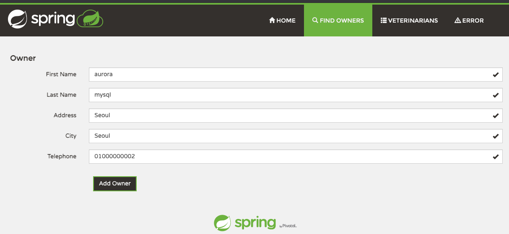
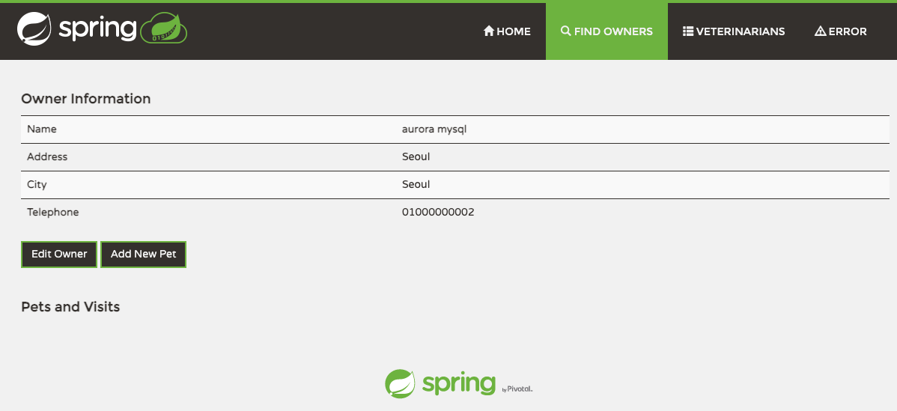

# PetClinic에서 사용하는 Repository를 Aurora MySQL로 변경합니다.

1. 다음 directory로 이동합니다.

```
ubuntu@ip-172-31-0-145:~/spring-petclinic$ cd src/main/resources/db/mysql/
ubuntu@ip-172-31-0-145:~/spring-petclinic/src/main/resources/db/mysql$ ls
data.sql  petclinic_db_setup_mysql.txt  schema.sql  user.sql

```

2. cat으로 user.sql, schema.sql, data.sql을 살펴 봅니다.

3. petclinic DB를 생성하는 script를 실행합니다. `mysql -h$DBURL -u$DBUSER -p"$DBPASS" < user.sql`

```
ubuntu@ip-172-31-0-145:~/spring-petclinic/src/main/resources/db/mysql$ mysql -h$DBURL -u$DBUSER -p"$DBPASS" < user.sql
mysql: [Warning] Using a password on the command line interface can be insecure.
```

4. 신규 생성된 petclinic user를 이용하여 petclinic DB가 정상적으로 생성되었는지 확인합니다.

```
ubuntu@ip-172-31-0-145:~/spring-petclinic/src/main/resources/db/mysql$ mysql -h$DBURL -upetclinic -ppetclinic -e "show databases"
mysql: [Warning] Using a password on the command line interface can be insecure.
+--------------------+
| Database           |
+--------------------+
| information_schema |
| petclinic          |
+--------------------+

ubuntu@ip-172-31-0-145:~$ mysql -h$DBURL -u$DBUSER -p"$DBPASS" -e "GRANT SELECT, INSERT, UPDATE, DELETE, CREATE, DROP, RELOAD, PROCESS, REFERENCES, INDEX, ALTER, SHOW DATABASES, CREATE TEMPORARY TABLES, LOCK TABLES, EXECUTE, REPLICATION SLAVE, REPLICATION CLIENT, CREATE VIEW, SHOW VIEW, CREATE ROUTINE, ALTER ROUTINE, CREATE USER, EVENT, TRIGGER, LOAD FROM S3, SELECT INTO S3, INVOKE LAMBDA, INVOKE SAGEMAKER, INVOKE COMPREHEND ON *.* TO 'petclinic'@'%' WITH GRANT OPTION"
mysql: [Warning] Using a password on the command line interface can be insecure.
```

5. petclinic user를 이용하여 schema를 생성합니다.

```
ubuntu@ip-172-31-0-145:~/spring-petclinic/src/main/resources/db/mysql$ mysql -h$DBURL -upetclinic -ppetclinic petclinic <schema.sql
mysql: [Warning] Using a password on the command line interface can be insecure.
ubuntu@ip-172-31-0-145:~/spring-petclinic/src/main/resources/db/mysql$ mysql -h$DBURL -upetclinic -ppetclinic petclinic -e "show tables"
mysql: [Warning] Using a password on the command line interface can be insecure.
+---------------------+
| Tables_in_petclinic |
+---------------------+
| owners              |
| pets                |
| specialties         |
| types               |
| vet_specialties     |
| vets                |
| visits              |
+---------------------+
```

6. petclinic user를 이용하여 data를 입력합니다.

```
ubuntu@ip-172-31-0-145:~/spring-petclinic/src/main/resources/db/mysql$ mysql -h$DBURL -upetclinic -ppetclinic petclinic <data.sql
mysql: [Warning] Using a password on the command line interface can be insecure.
ubuntu@ip-172-31-0-145:~/spring-petclinic/src/main/resources/db/mysql$ mysql -h$DBURL -upetclinic -ppetclinic petclinic -e "select first_name from owners order by 1"
mysql: [Warning] Using a password on the command line interface can be insecure.
+------------+
| first_name |
+------------+
| Betty      |
| Carlos     |
| David      |
| Eduardo    |
| George     |
| Harold     |
| Jean       |
| Jeff       |
| Maria      |
| Peter      |
+------------+

```

7. backup configuration files

```
ubuntu@ip-172-31-0-145:~/spring-petclinic/src/main/resources/db/mysql$ cd ~/spring-petclinic/
ubuntu@ip-172-31-0-145:~/spring-petclinic$
ubuntu@ip-172-31-0-145:~/spring-petclinic$ mkdir -p ~/backup
ubuntu@ip-172-31-0-145:~/spring-petclinic$ cp ./pom.xml ~/backup/
ubuntu@ip-172-31-0-145:~/spring-petclinic$ cp src/main/resources/application.properties ~/backup/
```

8. Edit configuration files

```
ubuntu@ip-172-31-0-145:~/spring-petclinic$ vi src/main/resources/application.properties
ubuntu@ip-172-31-0-145:~/spring-petclinic$ diff ~/backup/application.properties src/main/resources/application.properties
25a26,30
>
> spring.datasource.driver-class-name=com.mysql.cj.jdbc.Driver
> spring.datasource.url=jdbc:mysql://auroralab-mysql-cluster.cluster-cn9obtetnzbc.ap-northeast-2.rds.amazonaws.com:3306/petclinic
> spring.datasource.username=petclinic
> spring.datasource.password=petclinic
```

9. edit pom.xml

```
    <dependency>
      <groupId>org.mariadb.jdbc</groupId>
      <artifactId>mariadb-java-client</artifactId>
      <version>2.5.4</version>
    </dependency>

ubuntu@ip-172-31-0-145:~/spring-petclinic$ vi pom.xml
ubuntu@ip-172-31-0-145:~/spring-petclinic$ diff ~/backup/pom.xml ./pom.xml
84a85,90
>     <dependency>
>       <groupId>org.mariadb.jdbc</groupId>
>       <artifactId>mariadb-java-client</artifactId>
>       <version>2.5.4</version>
>     </dependency>
>
```

10. rebuild and run application

```
ubuntu@ip-172-31-0-145:~/spring-petclinic$ ./mvnw package -Dmaven.test.skip=true
ubuntu@ip-172-31-0-145:~/spring-petclinic$ java -jar target/*.jar -Dspring.profiles.active=mysql
```

11. Application 접속 및 DB 내용 확인 http://EC2-Public-IP:8080
    <kbd>  </kbd>

내장 H2 DB에 저장했던 최초 Owner Data와 Pet Data가 없음을 확인합니다.

12. Application에서 신규 Aurora MySQL 로 data를 입력합니다. "Add Owner"를 Click하고 신규 Owner, Pet 정보를 입력합니다.
    <kbd>  </kbd>

    <kbd>  </kbd>

    <kbd>  </kbd>

    <kbd>  </kbd>

13. Aurora MySQL에 접속하여 입력한 정보들이 DB에 저장되었는지 확인 합니다.

```
ubuntu@ip-172-31-0-145:~/spring-petclinic$ mysql -h$DBURL -upetclinic -ppetclinic
mysql> use petclinic;
mysql> select id,first_name,last_name from owners order by 1;
+----+------------+-----------+
| id | first_name | last_name |
+----+------------+-----------+
|  1 | George     | Franklin  |
|  2 | Betty      | Davis     |
|  3 | Eduardo    | Rodriquez |
|  4 | Harold     | Davis     |
|  5 | Peter      | McTavish  |
|  6 | Jean       | Coleman   |
|  7 | Jeff       | Black     |
|  8 | Maria      | Escobito  |
|  9 | David      | Schroeder |
| 10 | Carlos     | Estaban   |
| 11 | aurora     | mysql     |
+----+------------+-----------+
11 rows in set (0.01 sec)

mysql> select id, name, type_id from pets where owner_id=11;
+----+----------------+---------+
| id | name           | type_id |
+----+----------------+---------+
| 14 | RDS-Aurora-DOG |       2 |
+----+----------------+---------+
1 row in set (0.00 sec)
```

14. mysqldump로 현재 Data를 backup 받습니다.(이후 Aurora Serverless에서 사용합니다.)

```
ubuntu@ip-172-31-0-145:~$ mysqldump --column-statistics=0 -h$DBURL -upetclinic -ppetclinic petclinic > petclinic-backup.sql
```

14. 현재 실행중인 PetClinic Application을 중지합니다. (CTRL+C)로 실행중인 Java process를 종료합니다.

```
ubuntu@ip-172-31-0-145:~$  mysql -h$DBURL -u$DBUSER -p"$DBPASS"
mysql> use petclinic;

DELIMITER $$
DROP PROCEDURE IF EXISTS minute_rollup$$
CREATE PROCEDURE minute_rollup(input_number INT)
BEGIN
 DECLARE counter int;
 DECLARE out_number float;
 set counter=0;
 WHILE counter <= input_number DO
 SET out_number=SQRT(rand());
 SET counter = counter + 1;
END WHILE;
END$$
DELIMITER ;

DROP TABLE IF EXISTS `sbtest1`;
CREATE TABLE `sbtest1` (
 `id` int(10) unsigned NOT NULL AUTO_INCREMENT,
 `k` int(10) unsigned NOT NULL DEFAULT '0',
 `c` char(120) NOT NULL DEFAULT '',
 `pad` char(60) NOT NULL DEFAULT '',
PRIMARY KEY (`id`),
KEY `k_1` (`k`)
) ENGINE=InnoDB DEFAULT CHARSET=latin1;


```

15. 수고하셨습니다. 다음 챕터로 이동하세요. [AuroraLab04.md](AuroraLab04.md)
