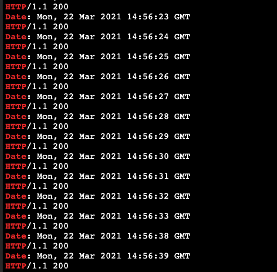
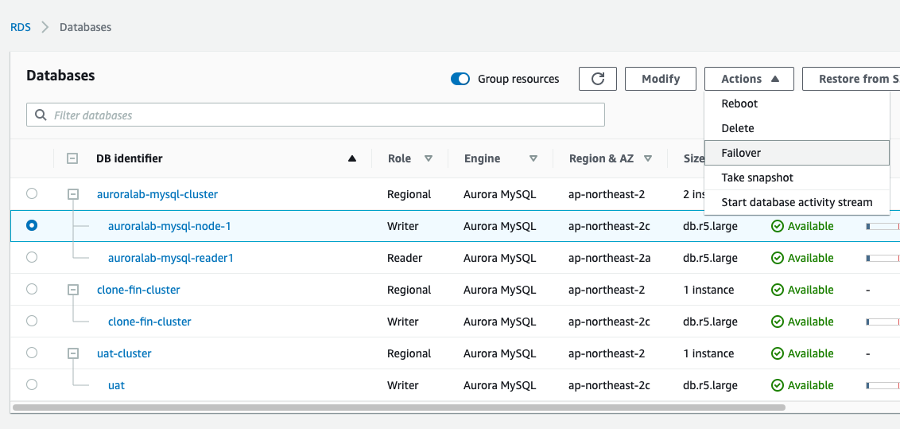
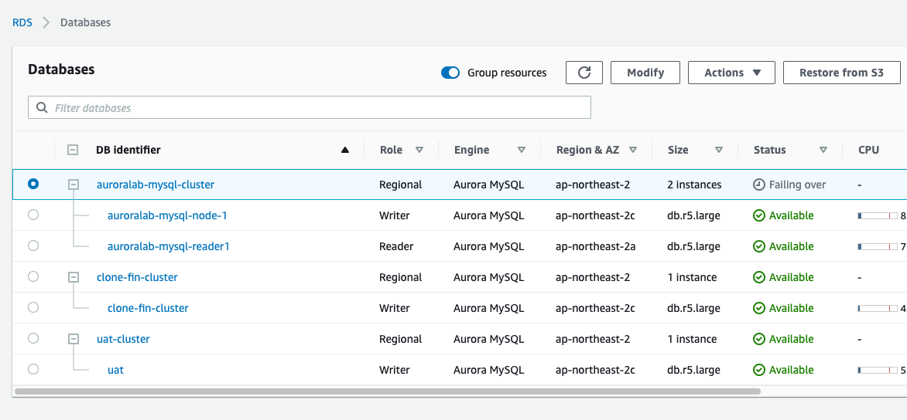
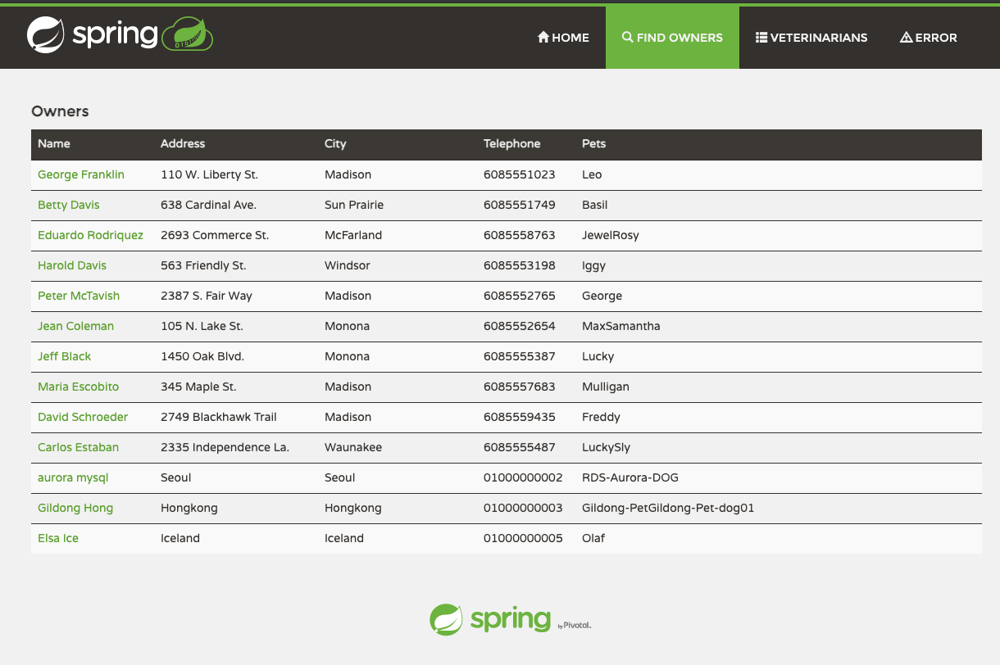

# Aurora의 뛰어난 가용성을 확인 합니다.

**Aurora는 3개의 가용영역에 6개의 Data copy를 가지고 있기 때문에 뛰어난 Durability를 보장**

**Aurora의 Failover는 15~40초만에 완료되며, RDS-PROXY를 앞에 둘 경우 더 빠른 Failover 시간을 제공**

## Read Replica를 확인하고 endpoint 개념을 확인합니다.

1.  Services -> RDS -> Databases

---

2.  Role이 Reader인 auroralab-mysql-reader2를 확인합니다.

    <kbd>  </kbd>

---

3.  다음의 주소를 복사해서 Browser의 새 창에 Copy and Paste합니다. System Manager를 2개를 이용하기 위함입니다.

`https://ap-northeast-2.console.aws.amazon.com/systems-manager/session-manager?region=ap-northeast-2`

---

4.  auroralab-mysql-workstation 선택 후 "Start Session" click

    <kbd>  </kbd>

---

5.  curl을 이용하여 PetClinic의 Owner 정보 요청 API를 계속 호출합니다. IP는 앞에서 확인한 EC2 Public IP로 변환해서 실행합니다.

```
curl http://52.78.88.109:8080/owners/13
```

```
while true
do
curl -Is http://13.125.117.181:8080/owners/13 | grep -E 'HTTP|Date'
sleep 1
done
```

<kbd>  </kbd>

---

6. Aurora DB를 장애 상황을 가정하고 Failover 실행합니다. Services => RDS => Databases

---

7. Primary node(Current Writer)인 auroralab-mysql-node-1을 선택 후, Actions => "Failover" Click

   <kbd>  </kbd>

---

8. Failover Click

   <kbd>  </kbd>

---

9. Cluster에서 Failover 가 동작 확인합니다.

   <kbd>  </kbd>

---

10. curl을 실행한 Session Manager로 돌아가서 curl status 변화를 확인, 거의 단절 없이 Service 됨을 확인합니다.

    <kbd>  </kbd>

---

11. auroralab-mysql-node2가 Writer 역할로 Failover되었음을 확인합니다.

    <kbd>  </kbd>

---

12. Failover 후에도 PetClinic application 정상 동작 확인합니다.

    <kbd>  </kbd>

---

13. 이로써 Aurora Database 안전하고 빠른 Failover 기능을 확인하였습니다.

---

14. 수고하셨습니다. 다음 챕터로 이동하세요. [AuroraLab06.md](AuroraLab06.md)
