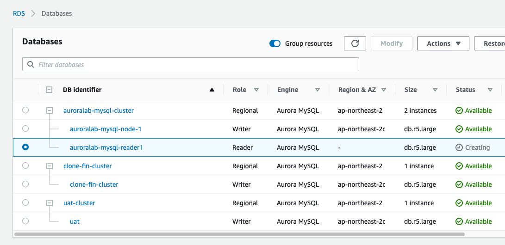
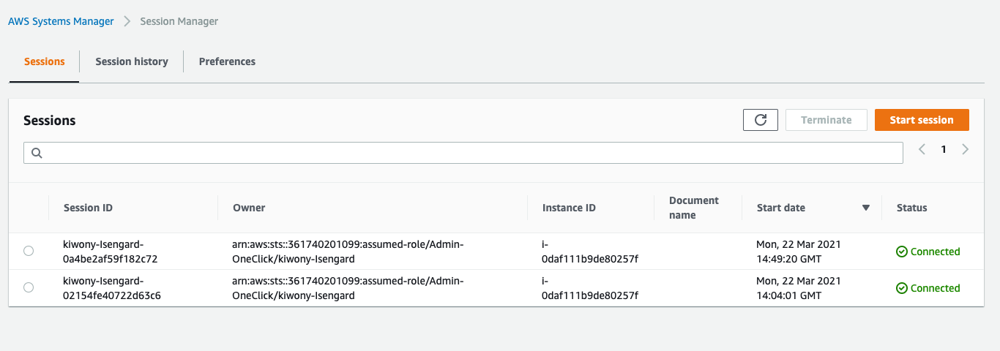
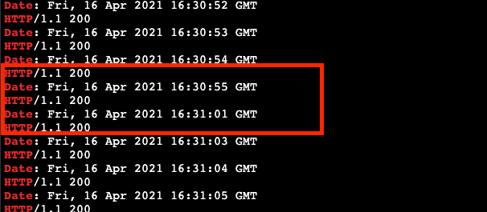
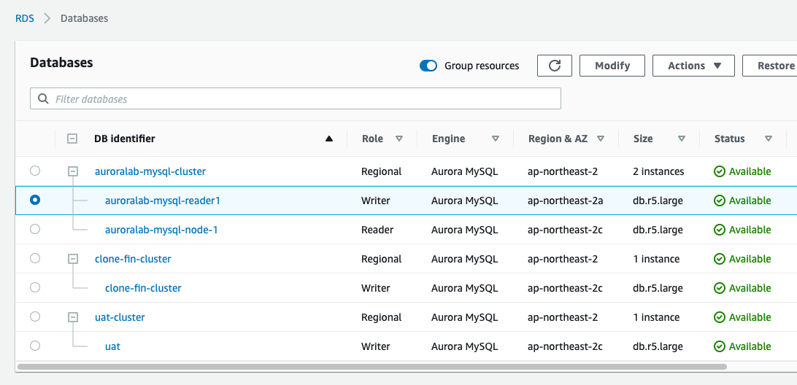

# Aurora의 뛰어난 가용성을 확인 합니다.

**Aurora는 3개의 가용영역에 6개의 Data copy를 가지고 있기 때문에 뛰어난 Durability를 보장**

**Aurora의 Failover는 15~40초만에 완료**

## Read Replica를 만들고 Failover를 확인 해보겠습니다.

1.  auroralab-mysql-cluster을 선택 후 Actions => "Add Reader"를 Click(다른 Region으로 생성을 원할 경우 cross-region read replica 사용)

    <kbd>  </kbd>

2.  Add Reader

    1. DB instance identifier : auroralab-mysql-reader1
    2. 나머지 값은 Default 사용
    3. "Add reader" Click

3.  신규 Reader node auroralab-mysql-reader1 가 생성됨을 확인

    <kbd>  </kbd>
    <kbd>  </kbd>

4.  Session Manager를 하나 더 시작. Services => System Manager => Session Manager => "Start session" click
    <kbd>  </kbd>

5.  auroralab-mysql-workstation 선택 후 "Start Session" click
    <kbd>  </kbd>

6.  curl을 이용하여 PetClinic API를 계속 호출

```
while true
do
curl -Is http://13.125.117.181:8080/owners/13 | grep -E 'HTTP|Date'
sleep 1
done
```

    <kbd>  </kbd>

7. Aurora DB를 장애 상황을 가정하고 Failover 실행. Services => RDS => Databases

8. Primary node인 auroralab-mysql-node-1을 선택 후, Actions => "Failover" Click
   <kbd>  </kbd>

9. Failover Click
   <kbd>  </kbd>

10. Cluster에서 Failover 가 동작 확인
    <kbd>  </kbd>

11. curl을 실행한 Session Manager로 돌아가서 curl status 변화를 확인, 거의 단절 없이 Service 됨을 확인
    <kbd>  </kbd>

12. auroralab-mysql-reader1 이 Write 역할로 Failover
    <kbd>  </kbd>
